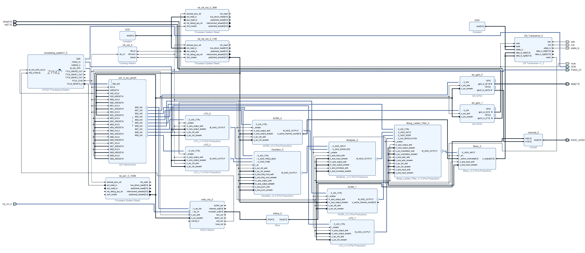

# Digital Synthesizer
This repository contains the Xilinx Vivado and SDK project files for a digital music synthesizer implemented on a Xilinx Zynq 7020 SoC+FPGA. The project was developed using a Zedboard development board and a I2S2 PMOD from Digilent. 

Audio synthesis and digital signal processing is perfomed in the programmable logic part of the SoC. The synthesizer was designed to be modular, all DSP functions are implemented as individual modules and communicate with eachother using the AXI Stream protocol, allowing modules to be easily added and removed as well as connected in different ways. Modules each have a AXI4 Lite interface so that their parameters can be configured by the ARM processor.

The Zynq's ARM processor was programmed to use the on chip XADC to sample the dials of a custom interface and configure the corresponding modules in the synthesizer using the AXI4 Lite protocol, an [analog multiplexer PCB](https://github.com/laura-regan/XADC-Multiplexer-PCB) was designed to multiplex between the multiple dials. The ARM processor also uses a UART core along with a custom designed [MIDI interface PCB](https://github.com/laura-regan/MIDI-Interface-PCB) to communicate with external MIDI equipment such as MIDI keyboards. A I2S transceiver was designed to transfer audio samples between the synthesizer's modules and the 24-bit DAC on the I2S PMOD. All hardware modules were written in VHDL.

To aid in the control and testing of the synthesizer during its development an [application](https://github.com/laura-regan/Qt-Synthesizer-Interface) was developed using Qt to act as a virtual interface.

The current synthesizer implementation includes three numerically controlled oscillators, three LFOs, two ADSR envelope generators, a numerically controlled amplifier, a digital implementation of the Moog ladder filter and a mixer. All modules have a polyphony of 128 independent voices. The audio sampling rate of the design is 96kHz and the data size is 24-bit.

## Block diagram
The following block diagram displays the connection between the different modules.

